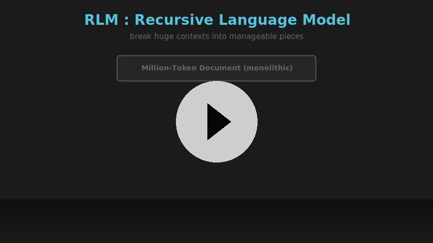

# mini-rlm

A lightweight Python toolkit for **Recursive Language Modeling** — giving an LLM the ability to step back, chunk up a big context, and call a helper LLM on each piece before answering.

Think of it like this: you dump a novel into a model and ask "what's the plot twist?" Most models can't handle a whole novel. But what if the model could break it into chapters, summarize each one, then read the summaries and answer? That's the idea.

<p align="center">
  <a href="https://github.com/Shuyib/mini-rlm/raw/main/rlm-animation/rlm_explainer_v3_slow.mp4">
    
  </a>
  <br/>
  <em>RLM pipeline: context too big → chunk → delegate → aggregate → answer</em>
</p>

## Why?

LLMs have context windows. Big ones, sure — 500K tokens, even a million. But they don't always use them well. Put a million tokens of noise in there and the signal gets lost in the middle.

RLM flips that. Instead of cramming everything into one giant prompt, the model gets a Python REPL to work in. It can:

- Inspect the context safely (check length, peek at slices, search with regex)
- Chunk it however makes sense — by character count, by headers, whatever
- Call a sub-LLM on each chunk with a specific question
- Collect the answers and synthesize a final response

The outer model orchestrates. The inner models do the heavy reading. It's a hierarchy of attention.

## What's in the box

| Thing | What it does |
|---|---|
| `rlm(query, context)` | Drop-in function: give it a question and a big blob of text, get back an answer |
| `RLM(context)` | Class-based version — more control, keeps chat history, configurable models |
| `prep_shell(context)` | Set up a Python REPL with context and llm_query wired in |
| `llm_query(query)` | Query a sub-LLM from inside the REPL |
| `run_repl(code)` | Execute Python in the REPL (used internally by the model) |
| `generate_massive_context()` | Generate test data with a hidden "magic number" — useful for demos |
| `print_history(rlm)` | Pretty-print a conversation with emoji role markers |
| `mm(graph)` | Render Mermaid diagrams inline (notebook-friendly) |
| `tool_mermaid(graph)` | Return Mermaid HTML blocks |

## Quick start

> **Note:** `mini_rlm` is not yet published on PyPI. Clone and install locally for now.

```bash
# Clone the repo
git clone https://github.com/Shuyib/mini-rlm.git
cd mini-rlm

# Install the package (editable mode recommended for development)
pip install -e .
```

Once published, you'll be able to install directly:

```bash
pip install mini_rlm
```

Set your API key:

```bash
export OPENROUTER_API_KEY="sk-or-..."
```

Then:

```python
from mini_rlm.rlm_lisette_v2 import rlm

context = "Some super long piece of text you want to analyze..."
answer = rlm("What's the key insight here?", context)
print(answer)
```

Or use the class for more control:

```python
from mini_rlm.rlm_lisette_v2 import RLM

rlm_agent = RLM(context, root_model="openai/gpt-oss-120b")
result = rlm_agent("Find the magic number in this text")
print(result)
```

## How it works

1. You pass a query and a context to `rlm()` or `RLM()`
2. It creates a Python REPL with:
   - `context` — your data as a variable
   - `llm_query()` — a function that fires off a sub-LLM query
3. The root model gets a system prompt explaining the REPL tools it has
4. It writes Python code to explore, chunk, and delegate
5. The code runs in the REPL. Output comes back. The model sees it.
6. When it's ready, it answers the original query

The system prompt has concrete examples — chunking by character count, splitting on markdown headers, maintaining buffers across iterations. The model doesn't have to figure it out from scratch.

## The system prompt (peek inside)

The REPL system prompt tells the model:

- You have a `context` variable. Don't print the whole thing — it could be millions of tokens. Use `len()`, slice it, search it.
- You have `llm_query()` — it can handle ~500K chars per call. Use it generously.
- Here's how to chunk. Here's how to call sub-LLMs. Here's how to build up a buffer of answers.
- Think step by step, then execute. Don't just say "I will do this" — actually do it.

```python
# Example strategy: chunk by 10K chars
chunk = context[:10000]
answer = llm_query(f"What's in chunk 1? {chunk}")
```

## Who this is for

- You've got a big document and need to ask specific questions about it
- You want to experiment with recursive / hierarchical LLM architectures
- You're curious about the RLM paper from Zhang et al. and want a hands-on playground
- You prefer working in notebooks with nbdev

## Notebook-first (nbdev)

This project uses [nbdev](https://nbdev.fast.ai/) — the source of truth lives in notebooks under `nbs/`, and the Python package is auto-generated from them.

Development workflow:

```bash
make install                # create venv, install deps
make nbdev-install          # install nbdev
make nbdev-hooks            # git hooks to clean notebook metadata
make nbdev-export           # regenerate mini_rlm/ from notebooks
make nbdev-prepare          # export + test + clean (do this before push)
```

Don't hand-edit files in `mini_rlm/` — they get overwritten on every export.

## Working with AI Agents

This repository includes an `AGENTS.md` file designed for AI coding agents (Claude Code, Codex, Copilot, Cursor, Hermes, etc.). It covers project structure, the nbdev workflow (notebooks are source of truth, not `mini_rlm/` files), key API surfaces, common development tasks, and Make targets. AI agents should read `AGENTS.md` when first opening this repo.

## Credits

- This package builds on [Alex Zhang's RLM blog post and research](https://alexzhang13.github.io/blog/2025/rlm/)
- The [original notebook](https://share.solve.it.com/d/024412293157f7aabef9fc2e7746e8bd) was shared on SolveIt by an anonymous author — turned into a package with OpenRouter support
- Built with [lisette](https://github.com/AnswerDotAI/lisette) (tool-use LLM framework), [litellm](https://github.com/BerriAI/litellm) (LLM API standardization), and [toolslm](https://github.com/AnswerDotAI/toolslm) (REPL shell)

## License

Apache 2.0
